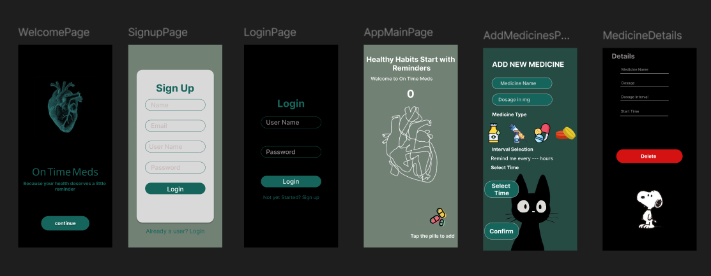

# 💊 On Time Meds

**On Time Meds** is a native Android application developed in **Java** using **Android Studio**. It helps users manage their medication schedule efficiently by allowing them to **add medicines**, **set reminders**, and **delete entries** with ease.

---

## ✨ Features

- ➕ **Add Medicine** – Input medicine name, dosage, and reminder time  
- ⏰ **Set Reminders** – Get timely alerts so you never miss a dose  
- 🗑️ **Delete Medicine** – Remove medications when they’re no longer needed  
- 📱 **Simple UI** – Clean and user-friendly interface  

---

## 🛠 Tech Stack

- **Language**: Java  
- **IDE**: Android Studio  
- **Platform**: Native Android  
- **Designs**: Created with Figma.
- 🔗 [View Full Figma Design](https://www.figma.com/your-design-link-here)   

---

## 🎨 Figma Design Preview

Below is a preview of the design created in Figma:

---
